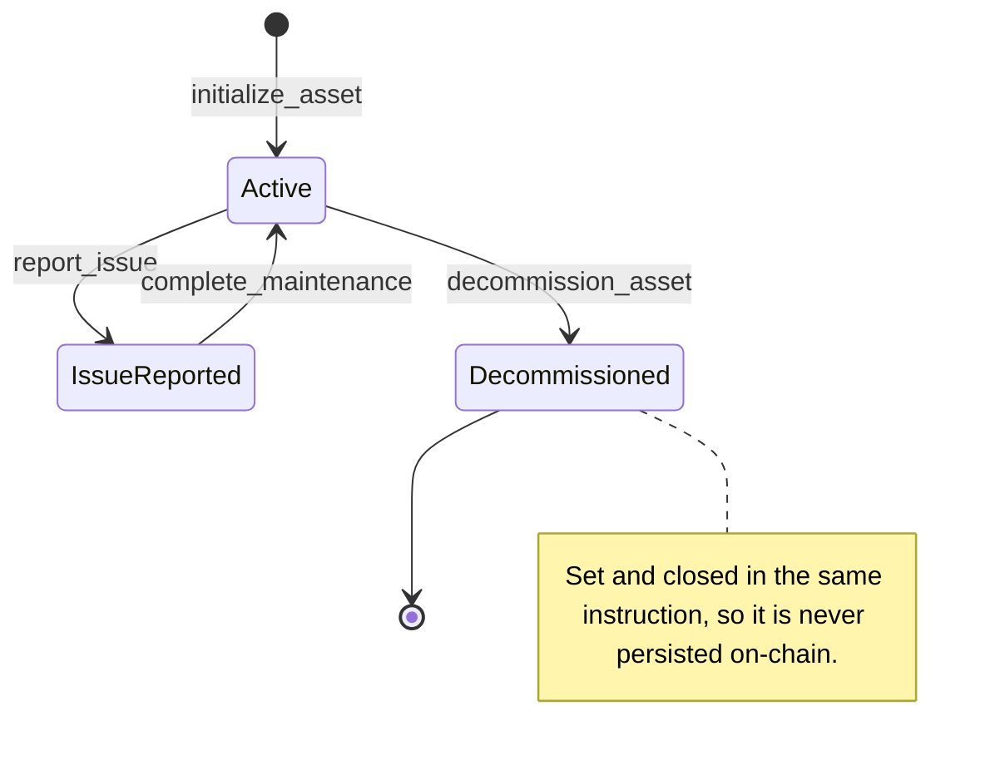

# Technical Architecture — Medovant Protocol

Reference document for the system architecture.

---

## Versions

| Version | Status | Description |
|---------|--------|-------------|
| v1.0 | ✅ Deployed (Devnet) | Technical MVP — hackathon |
| v1.1 | 🔄 In development | Incubation — indexer + off-chain DB |
| v2.0 | 📋 Planned | Wallet abstraction + CMMS integration |

---

## System layers

### Layer 1 — Client (Browser)

**Stack:** React 18 + Vite + TypeScript + Tailwind CSS

Two differentiated modes within the same application:
- **Hospital Mode:** asset registration, issue reporting, maintenance verification
- **Technician Mode:** available orders view, automatic payout, reputation

**Design principle:** the user does not need to understand wallets, SOL, or transactions to operate. Blockchain complexity runs underneath the interface.

**Wallet integration:** `@solana/wallet-adapter` + Phantom. Target v1.1: wallet abstraction for non-crypto users (custodial wallets or delegated signing).

---

### Layer 2 — Solana (On-chain)

**Stack:** Anchor 0.32.1 + Rust

**Program ID:** `5JMd8ADy1KHBhohX6NLbz6WQdyCQTfLd55Gmzo2r34WD`

**Network:** Devnet (prototype)

#### Instructions

| Instruction | Signers | On-chain effect |
|-------------|-----------|----------------|
| `register_technician` | technician | Creates TechnicianProfile PDA |
| `initialize_asset(asset_id)` | hospital | Creates Asset PDA, status = Active |
| `report_issue(reward)` | hospital | Creates Vault PDA, transfers SOL, failure_count++ |
| `complete_maintenance` | hospital + technician | invoke_signed releases SOL, jobs_completed++ |
| `decommission_asset` | hospital | Closes Asset PDA, returns rent |

#### Dual-Wallet `complete_maintenance` (PST Hand-Off)

Since **v1.0** the `complete_maintenance` instruction requires **two distinct signers** (hospital + technician). To avoid sharing private keys, the protocol uses a **Partially Signed Transaction (PST) hand-off**:

1. **Hospital** builds the tx, signs partially (fee payer), exports JSON payload.
2. **Technician** imports payload, re-derives all PDAs from trusted fields, verifies invariants, adds their signature, submits.

Full specification: [`docs/PST_HANDOFF.md`](PST_HANDOFF.md)

#### PDAs (Program Derived Addresses)

**Asset PDA**
```
seeds: [b"equipment", hospital_pubkey, asset_id_u64_le]
data: hospital, asset_id, status, last_maintenance, bump, maintenance_reward, failure_count
states: Active (0) | IssueReported (1) | UnderMaintenance (2) | Decommissioned (3)
```

**Vault PDA**
```
seeds: [b"vault", asset_pda]
type: system-owned (space=0) — the only correct pattern for native SOL escrow
release: invoke_signed with vault_seeds — cannot be debited via ordinary CPI
data: SOL only (no struct data)
```

**TechnicianProfile PDA**
```
seeds: [b"technician", tech_pubkey]
data: technician, jobs_completed, total_earned, bump
purpose: verifiable reputation, portable across institutions
```

#### Escrow mechanism

```rust
// report_issue: creates vault and locks SOL
system_program::create_account(
    CpiContext::new_with_signer(
        ctx.accounts.system_program.to_account_info(),
        CreateAccount { from: hospital, to: vault },
        &[vault_seeds]
    ),
    rent_exempt_minimum,
    0,  // space = 0, system-owned
    &system_program::ID,
)?;
system_program::transfer(CpiContext::new(...), reward)?;

// complete_maintenance: releases SOL to the technician
system_program::transfer(
    CpiContext::new_with_signer(..., &[vault_seeds]),
    reward
)?;
```

#### Asset lifecycle and escrow flow

The `AssetStatus` enum declares four states: `Active`, `IssueReported`, `UnderMaintenance`, `Decommissioned`. Only three are reachable — every transition below is enforced by a `require!` guard in its instruction.



`UnderMaintenance` is a reserved variant: no instruction in this version transitions to it.

`Decommissioned` is terminal: `decommission_asset` sets the status and Anchor closes the asset PDA, returning its rent to the hospital. Closing is rejected while an issue is pending (`AssetHasPendingEscrow`).

```mermaid
sequenceDiagram
    participant H as Hospital
    participant P as Medovant program
    participant A as MedicalAsset PDA
    participant S as System Program
    participant V as Vault PDA (system-owned)
    participant T as Technician
    participant TP as TechnicianProfile PDA

    H->>P: report_issue(reward)
    Note over H,P: hospital signs; funds vault rent + reward
    P->>S: create_account (vault PDA seeds signer)
    S->>V: new rent-exempt system-owned account
    H->>V: transfer reward (CPI via program)
    P->>A: status=IssueReported, maintenance_reward=reward, failure_count+1

    H->>P: complete_maintenance (hospital signs)
    T->>P: complete_maintenance (technician signs)
    P->>V: transfer reward via invoke_signed (vault seeds)
    V->>T: reward lamports
    P->>A: status=Active, maintenance_reward=0
    P->>TP: jobs_completed+1, total_earned+=reward
```

Note: after maintenance only rent-exempt lamports remain in the vault. `decommission_asset` drains that remainder to the hospital before the asset PDA closes, so no SOL is left in a vault without an owning asset.

---

### Layer 3 — Off-chain (v1.1 in development)

#### Event Indexer

**Stack:** Helius RPC webhooks

Listens to the on-chain program log and emits events as they occur:
- `AssetInitialized` → new asset registered
- `IssueReported` → issue with open escrow
- `MaintenanceCompleted` → payment released, reputation updated
- `AssetDecommissioned` → asset retired

#### Database

**Stack:** PostgreSQL via Supabase

Planned tables:
```
assets
  asset_pda       TEXT PRIMARY KEY   -- on-chain PDA public key
  hospital        TEXT               -- owner hospital pubkey
  name            TEXT               -- equipment name
  location        TEXT               -- physical location
  asset_type      TEXT               -- type (ventilator, MRI, etc.)
  created_at      TIMESTAMPTZ

maintenance_events
  id              UUID PRIMARY KEY
  asset_pda       TEXT REFERENCES assets
  event_type      TEXT               -- IssueReported | MaintenanceCompleted
  tx_signature    TEXT               -- Solana transaction signature
  evidence_url    TEXT               -- URL to photo/report in Supabase Storage
  timestamp       TIMESTAMPTZ
```

#### QR per asset (v1.1)

Each physical device will carry a QR tag encoding the URL:
```
https://app.medovant.io/asset/{asset_pda}
```

When scanned, the app loads the full asset history from the DB (metadata) and from the chain (current state).

---

## Full system flow

```
User (Hospital)
    │
    │  1. Connects Phantom Wallet
    ▼
React App
    │
    │  2. Calls initialize_asset(asset_id)
    ▼
@coral-xyz/anchor → Phantom signs tx
    │
    │  3. RPC transaction to Devnet
    ▼
Anchor Program
    │
    │  4. Creates Asset PDA on-chain
    │     seeds: [equipment, hospital, asset_id]
    ▼
Solana Devnet
    │
    │  5. Emits AssetInitialized event
    ▼
Event Indexer (Helius) [v1.1]
    │
    │  6. Persists metadata in DB
    ▼
PostgreSQL / Supabase [v1.1]
    │
    │  7. Frontend queries metadata
    ▼
React App shows updated inventory
```

---

## On-chain / off-chain split

| Data | Where it lives | Why |
|------|-----------|---------|
| Asset status (Active/IssueReported/Decommissioned) | On-chain | Immutable, auditable by anyone |
| SOL locked in escrow | On-chain | Trustless — no one can take it unilaterally |
| Technician reputation (jobs_completed) | On-chain | Portable across institutions, not modifiable |
| Transaction history | On-chain (Solana) | Immutable by design |
| Equipment name and location | Off-chain (DB) | No immutability benefit, lower costs |
| Maintenance evidence (photos, PDFs) | Off-chain (Storage) | Large files do not go on-chain |
| Evidence hash (optional) | On-chain | To verify integrity of the off-chain file |

---

## Technical risks

See [TECHNICAL_DEBT.md](TECHNICAL_DEBT.md) for full detail.

| Risk | Level | Mitigation |
|--------|-------|------------|
| Metadata in localStorage | 🔴 High | Migrate to Supabase (Week 3) |
| Discovery loop 1-10 | 🔴 High | getProgramAccounts or event indexer |
| Technician secret key in localStorage | 🔴 High | Technician's own Phantom wallet |
| UX barrier: user needs Phantom | 🟡 Medium | Wallet abstraction in v2.0 |
| CMMS integration (SAP, IBM Maximo) | 🟡 Medium | Public API in v2.0 |
| SOL escrow for institutional use | 🟡 Medium | Stablecoin abstraction in v2.0 |

---

## Critical dependencies

| Dependency | Version | Purpose |
|-------------|---------|-----------|
| `@coral-xyz/anchor` | 0.32.1 | Generates TypeScript types for the program |
| `@solana/wallet-adapter` | latest | Phantom and other wallet integration |
| `@solana/web3.js` | latest | RPC, transactions, PDAs |
| Helius RPC | — | Reliable RPC + webhooks for indexer (v1.1) |
| Supabase | — | PostgreSQL + Storage (v1.1) |
| Solana Devnet | — | Network used by this prototype |
